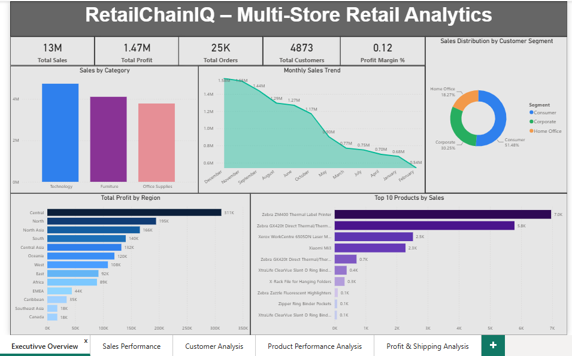

# RetailChainIQ – Multi-Store Retail Analytics Platform



## 📊 Project Overview

**RetailChainIQ** is an end-to-end Business Intelligence and Data Analytics project developed to simulate the analytics environment of a multi-store retail organization.

The project transforms raw retail transaction data into meaningful business insights using **SQL, Python, Power BI, and DAX**.

It focuses on sales performance, customer behaviour, product profitability, regional trends, discounts, shipping performance, and operational efficiency.

The final solution provides an interactive Power BI dashboard designed to help business stakeholders monitor KPIs, identify trends, and support data-driven decision-making.

---

## 🎯 Project Objective

The objective of RetailChainIQ is to transform raw retail transaction data into actionable business insights.

The project covers:

- Business Understanding
- Data Cleaning & Preprocessing
- Data Modelling
- SQL Analysis
- Python Data Analysis
- Feature Engineering
- Power BI Dashboard Development
- DAX Calculations
- Business Reporting
- Data Storytelling

---

## 🛠️ Technologies Used

| Technology | Purpose |
|---|---|
| **Python** | Data cleaning, preprocessing & analysis |
| **Pandas** | Data manipulation |
| **Jupyter Notebook** | Exploratory Data Analysis |
| **PostgreSQL / SQL** | Business & analytical queries |
| **Power BI** | Interactive dashboard development |
| **DAX** | KPI & analytical calculations |
| **GitHub** | Documentation & version control |

---

## 📈 Power BI Dashboard

The RetailChainIQ Power BI dashboard provides an executive-level view of retail performance.

### Executive Overview


### Dashboard Areas

- Executive Overview
- Sales Performance
- Customer Analysis
- Product Performance Analysis
- Profit & Shipping Analysis

---

## 📌 Key KPIs

The dashboard tracks important business metrics including:

- Total Sales
- Total Profit
- Total Orders
- Total Customers
- Profit Margin
- Sales by Category
- Monthly Sales Trends
- Sales by Customer Segment
- Profit by Region
- Top Products by Sales

---

## 🧮 SQL Analysis

The project includes an extensive PostgreSQL SQL analysis covering multiple business areas.

### Business KPIs
- Total transaction records
- Unique customers
- Unique orders
- Total products
- Total sales
- Total profit
- Average transaction value
- Average profit
- Average discount
- Average shipping cost

### Sales Analysis
- Sales by category
- Sales by sub-category
- Sales by customer segment
- Sales by market
- Sales by region
- Sales by country
- Sales by state
- Sales by city
- Top-selling products
- Top customers

### Customer Analysis
- Customer sales ranking
- Customer profitability
- Customer order frequency
- Average Order Value
- Customer segmentation
- Customer discounts
- Customer shipping costs
- Loss-making customers

### Product Analysis
- Product profitability
- Product sales ranking
- Product quantity
- Product discounts
- Product shipping costs
- Negative-profit products
- Product profit margins

### Regional & Market Analysis
- Market sales
- Market profit
- Regional sales
- Regional profit
- Country performance
- State performance
- City performance
- Regional shipping costs

### Advanced SQL

The project also demonstrates advanced PostgreSQL concepts including:

- CTEs
- Window Functions
- `RANK()`
- `DENSE_RANK()`
- `ROW_NUMBER()`
- `NTILE()`
- `LAG()`
- `LEAD()`
- Running Totals
- Moving Averages
- Pareto Analysis
- Contribution Analysis

---

## 🐍 Python Analysis

Python was used for data preparation and exploratory analysis, including:

- Data loading
- Data inspection
- Data cleaning
- Data transformation
- Feature engineering
- Exploratory Data Analysis
- Business-oriented analysis

---

## 📊 Dataset

The project uses a cleaned retail transaction dataset containing information related to:

- Orders
- Customers
- Products
- Categories
- Sales
- Profit
- Discounts
- Regions
- Markets
- Shipping
- Order Dates
- Customer Segments

---

## 🔍 Business Questions Addressed

RetailChainIQ addresses business questions such as:

- What is the overall sales and profit performance?
- Which categories generate the most sales?
- Which products generate the highest profit?
- Which customer segments contribute the most revenue?
- Which regions generate the highest sales and profit?
- Which products are underperforming?
- Which customers generate the highest sales?
- Which customers are most profitable?
- How do sales change over time?
- How do discounts relate to profitability?
- Which shipping modes generate significant costs?
- Which products have negative profitability?
- Which categories have stronger profit margins?
- What are the key executive-level KPIs?

---

## 💡 Business Analysis Areas

### Sales Performance
Analyze sales contribution across categories, products, regions, and customer segments.

### Customer Behaviour
Understand purchasing patterns and identify high-value customer groups.

### Product Performance
Analyze product sales, profitability, quantity, discounts, and performance.

### Regional Performance
Compare sales and profitability across different geographic regions.

### Profitability
Evaluate profit margins, discounts, and loss-making products.

### Operational Efficiency
Analyze shipping costs and delivery-related performance.

---

## 📁 Repository Structure

```text
RetailChainIQ/
│
├── README.md
│
├── Dashboard/
│   ├── RetailChainIQ_Dashboard.png
│   └── RETAILCHAINN.pbix
│
├── Data/
│   └── RetailChainIQ_Cleaned.csv
│
├── SQL/
│   └── RetailChainIQ_Master_SQL.sql
│
├── Python/
│   └── retail_store.ipynb
│
└── Documentation/
    └── Project_Objective.docx


## 👤 Author

**Aryan Rai**

📧 **Email:** aryanrai8572@gmail.com

🔗 **LinkedIn:** [Aryan Rai – Data Analyst](https://www.linkedin.com/in/aryanrai-dataanalyst)
